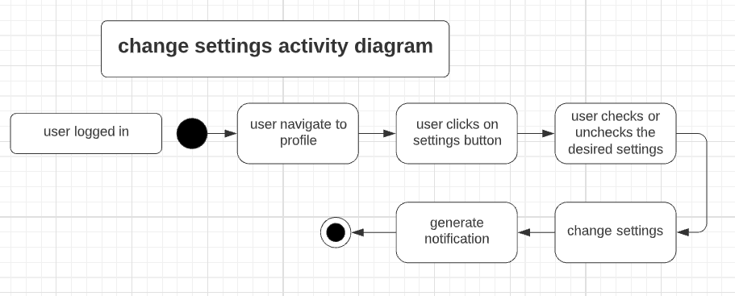

# EventHunt


# Übersicht

Das Projekt EventHunt, eine für Android entwickelte App, entstand im Rahmen des Moduls "Programmierung mobiler Endgeräte".
Ziel der App ist es, Nutzern eine Plattform zum erstellen, verwalten von und teilnehmen an lokalen Events zu bieten.
Hierfür werden verschiedene Funktionalitäten zur Verfügung gestellt. <br>EventHunt wurde in der Android Studio Umgebung entwickelt.

<br>

<details>
<summary> Allgemeine Projektübersicht </summary>
<br>

## Projektteam

*  **Jonas Weigelt** - [Profil](https://github.com/noergel1)        
*  **Amine Semlali** - [Profil](https://github.com/AmineSemlali)    
*  **Sarah Al Khodari** - [Profil](https://github.com/SarahElk1)    
  
  

## Funktionalitäten

Der Nutzer kann
- sich registrieren sowie ein- und ausloggen
- Events erstellen und bearbeiten
- Events beitreten
- sich alle Events anschauen und nach einer Liste von Optionen filtern
- eine Auflistung der beigetretenen und eigenen Events ausgeben lassen
- rudimentäre Settings verändern (kein realer usecase momentan)
- Notifications erhalten (z.B. bei geänderten Eventdaten) und diese löschen
- das eigene Profil bearbeiten<br><br>
</details>

<details>
<summary> Installation </summary>
<br>

  Um EventHunt lokal auszuführen, clonen sie sich das Repository wie gewohnt, und öffnen das Projekt in Android Studio.
  Für die bestmögliche Performance empfehlen wir einen Emulator mit Android API Level 30. Google Play ist zwingend notwendig.
  Außerdem sollten sie bei einem neu erstellten Image Google Maps mindestens einmal starten, da eine Standortbestimmung sonst nicht möglich ist.
    <br>
  ### BITTE BEACHTEN
  
  Eventuell ist die Verwendung von Standort-Funktionalitäten nicht möglich. Sollte dies der Fall sein, müssen sie den in der App hinterlegten Google API-Key ändern.
  Hierfür muss ein eigener Key vom Nutzer erstellt werden. <br> 
  Wie dies geht finden sie [hier](https://developers.google.com/maps/documentation/javascript/get-api-key).
  
      Folgende APIs müssen aktiviert sein:
      [Geolocation API](https://console.cloud.google.com/apis/library/geolocation.googleapis.com)
      [Google Maps SDK for Android](https://console.cloud.google.com/apis/library/maps-android-backend.googleapis.com)
      [Places API](https://console.cloud.google.com/apis/library/places-backend.googleapis.com)
      [Geocoding API](https://console.cloud.google.com/apis/library/geocoding-backend.googleapis.com)
  
  Sobald sie den passenden Key erstellt haben, müssen sie die in
  <b>app/src/main/res/values/strings.xml</b>
  gespeicherte Variable <b>"api_key"</b> mit ihrem Schlüssel ersetzen <br> <br>
            ```<string name="api_key">{  YOUR KEY  }</string>```
  
  <br>
  Bereits bestehender Testaccount<br>
  Email: viktor@web.de<br>
  Password: pass123456<br><br>
  
  Um den Distanzfilter an unseren vorgefertigten Events zu testen, empfehlen wir eine Position im Raum Erfurt/Weimar zu wählen.<br><br>
  
</details>


<details><summary> Diagramme </summary><blockquote>

<details><summary> Aktivitätsdiagramme </summary><blockquote>

<details><summary> Registration und Login </summary>
  

</details>
<details><summary> Logout </summary>
  

</details>
  
<details><summary> Filter Events </summary>
  

</details>
<details><summary> Create Event </summary>
  

</details>
  
<details><summary> Edit Event </summary>
  

</details>
<details><summary> Show Event Details </summary>
  

</details>
  
<details><summary> Show and Edit Profile </summary>
  

</details>
<details><summary> Owned/Joined Events Summary </summary>
  

</details>
  
  <details><summary> Show and Delete Notifications </summary>
  

</details>
<details><summary> Change Settings </summary>
  

</details>

</blockquote></details>

<details><summary> Use-Case Diagramme </summary><blockquote>

  <details><summary> Registration und Login </summary>
  

</details>
<details><summary> Event Management </summary>
  

</details>
    <details><summary> Profil Management </summary>
  

</details>
<details><summary> Erstellen und Bearbeiten von Events </summary>
  

</details>
      <details><summary> Settings und Notifications </summary>
  

</details>
</blockquote></details>

</blockquote></details>


<details>
<summary> Genutzte Tools </summary>
<br>

Datenbank: <br>
- Firebase Firestore (Hauptdatenbank mit allen Referenzen)
- FirebaseAuth (Registrierung und An-/Abmeldung der Nutzer)
- Firebase Storage (Upload von Bildern -> Profil- und Eventfoto)

Andere:<br>
- Picasso (Laden und Anzeigen von Bildern)
- [Leku](https://github.com/AdevintaSpain/Leku) (Locationpicker)
- verschiedene Google APIs, vorrangig Geoloc und Places (Ortsnamen aus Koordinaten, bestimmung der Distanz zu einem Event)

Grafiken:
  - JustInMind (Wireframes)
  - LucidChart (Diagramme)
  - Powerpoint (Präsentationen)
  
  Kommunikation:
  - Discord
  - WhatsApp
  <br><br>
</details>

<details>
<summary> Bekannte Probleme und Mängel </summary>
  <br>
  
  - die Performance ist (zumindest auf Emulatoren mit API 31 und höher) nicht optimal. Selbst bei passender API Version kann es zu Problemen kommen. <br>
  - es ist kein funktionierender Landscapemode für die Fragmente implementiert. Einen Entwurf für diese kann man im dazugehörigen Branch finden. Die Fehler konnten wir nicht mehr rechtzeitig beheben.
  - ViewModels speichern Formulardaten nicht zwischen
  - einige kleinere Funktionen sind nicht implementiert.
    - Events können nicht gelöscht werden (bitte sehen sie sich das Layout des EditEvent Fragments an, aus uns unbekannten Gründen verändert sich das Layout nicht mehr -> Button erscheint nicht, Schrift des unteren Buttons unverändert)
    - Settings haben noch keine echte Verwendung. Man kann über diese bestimmen, welche Daten andere Nutzer sehen können. Allerdings gibts es keine Teilnehmerliste o.Ä. um diese zu betrachten.
    - wie oben beschrieben funktioniert der API-Key nur beim Ersteller des Keys. Woran dies liegt wissen wir nicht. Das Problem besteht erst seit kurzem.<br><br>
</details>

<details>
<summary> Nächste Schritte </summary>
<br>
  
  - Beseitigen der Bugs und erstellen Funktionaler Landscapes mit Speichern der Formulardaten (Siehe Abschnitt Bekannte Probleme und Mängel)
  - Implementieren eines Chats innerhalb der Events. Ansonsten ist eine Koordination von Events schwierig.
  - Weitere Komfortfunktionen wie z.B. Events mit Passwörtern versehen.
  <br><br>
</details>

<details>
<summary> Lessons learned </summary>
<br>
  Wir haben sehr motiviert angefangen, und schnell die meisten von uns geplanten Funktionen implementiert. Durch die Prüfungsphase und Unzufriedenheiten mit der Gruppendynamik haben wir aber unser Tempo gegen Ende verloren. Leider ist EventHunt dadurch zum Zeitpunkt der Abgabe nicht so ausgereift, wie wir es uns wünschen würden. <br>
  Gelernt haben wir, dass Kommunikation (im Team und mit der Lehrkraft) das wahrscheinlich wichtigste ist, um ein Projekt erfolgreich zum Abschluss zu bringen.<br>
  Alles in allem hatten wir dennoch viel Spaß während der Entwicklung des Projekts und sind zufrieden mit der von uns erbrachten Leistung.<br><br>
</details>
